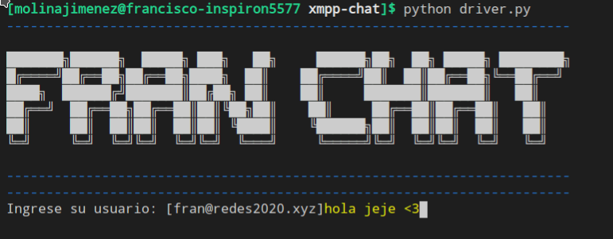
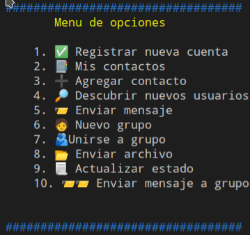

Computer Networking: Project 2 - XMPP Client
======
**FRAN-CHAT** This CLI Python script is a basic XMPP client it is used to communicate between users to connected to a XMPP server. 

## Screenshots 🖼



## Dependencies & Requirements 📦
 This program was written in Python 3.8.5, 64-bit for best experience it is recommended to run in this Python version. 
 Same experience is not guaranteed in other Python versions.
 This program contains the following Python packages which need to be installed prior to the usage of the program. 
 Please use your Python package installer and download the following packages: 
 
 ```shell
$ pip install bullet
```
```shell
$ pip install tkinter
```

```shell
$ pip install colorama
```

```shell
$ pip install xmpppy
```

```shell
$ pip install sleekxmpp
```

Aditionally the program uses the following libraries:
* base64
* threading
* time
* binascii
* os


## Installation 🗃️
```shell
$ git clone https://github.com/molinajimenez/xmpp-chat.git
```
#### ⚠️ WARNING ⚠️: Please make sure you run the following commands after installing all the packages. If this step is not done, the program **won't work**.

```shell
$ pip uninstall pyasn1 peas-modules sleekxmpp
```
```shell
$ pip install pyasn1==0.3.6 pyasn1-modules==0.1.5 sleekxmpp==1.3.3
```
If you happen to experience import or dependency problems, please run the following command:
```shell
$ pip install -r requirements.txt
````
Special thanks to my friend [Hayri Yigit](https://github.com/hayriyigit) for suggesting the usage of such command. 🎉
#### **Notice** : While this client was being made, the SleekXMPP package was officially decrecated. The migration to Slixmpp was not done due to development constraints. 
## Usage ⚙
This program requires an account to start the connection with the XMPP server, there's an account already created for you.
* JID: fran@redes2020.xyz
* PW: 123456

After this, the program will display a simple menu, the program is in spanish as this is my native language. The following implemented functionalities are:
1. Register a new user
2. My contacts
3. Add contact
4. Search users in server
5. Send a message
6. New group
7. Join a group
8. Send a file ⚠ - it only supports sending .jpg and .png files
9. Update my status
10. Send message to a group 
11. Deactivate my account
12. Exit program

## Implemented Behaviour 🙂
At the moment implementing status lets you update to: offline status and active status, composing is not implemented to be set.
The client however can show which users are active, composing or offline.

Also, if you receive a friend request, it automatically adds the user as a friend.
## Contributors & References 👤
 This program was made by Francisco Molina and some examples taken from the following links.
* [Francisco Molina ](https://github.com/molinajimenez)

#### References 📘
* [SleekXMPP Documentation](https://sleekxmpp.readthedocs.io/en/latest/index.html)
* [SleekXMPP Examples](https://github.com/fritzy/SleekXMPP/tree/develop/examples)
* [Sleek Standard Specifications](https://xmpp.org/extensions/)
* [XMPP - definitive guide](https://oriolrius.cat/blog/wp-content/uploads/2009/10/Oreilly.XMPP.The.Definitive.Guide.May.2009.pdf)

## Version 
* Version 1.0


## Contact 🙂
#### Developer
* e-mail: mol17050@uvg.edu.gt
